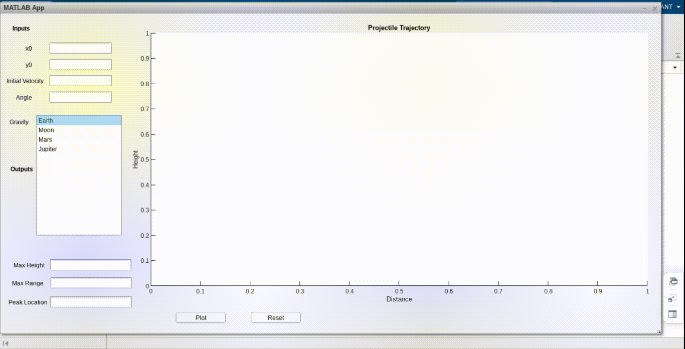

# Projectile
MATLAB app which plots the trajectory of a given projectile for different gravitational values. It takes initial position, initial velocity and angle of projection as input and displays the trajectory along with the max height, range and peak position of the projectile.

# GUI Interface

Used the MATLAB App Designer to create a GUI in order to make the app look interactive.

# Different Gravitational Acceleration Values

Option to set different values of acceleration due to gravity as per different gravitational bodies including moon, mars and jupiter.
